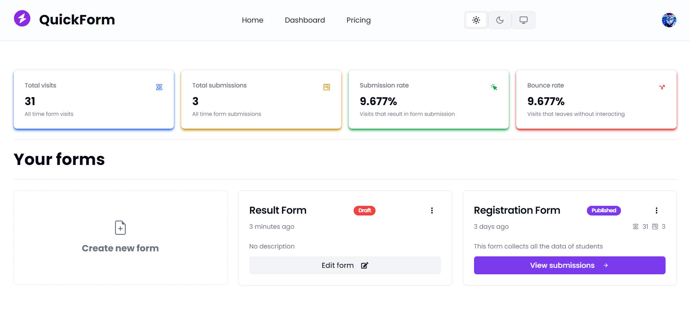
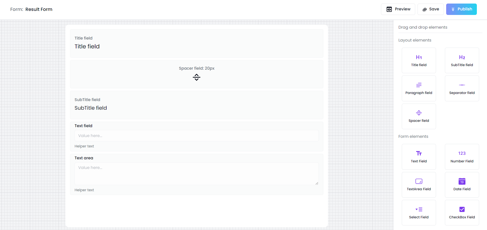
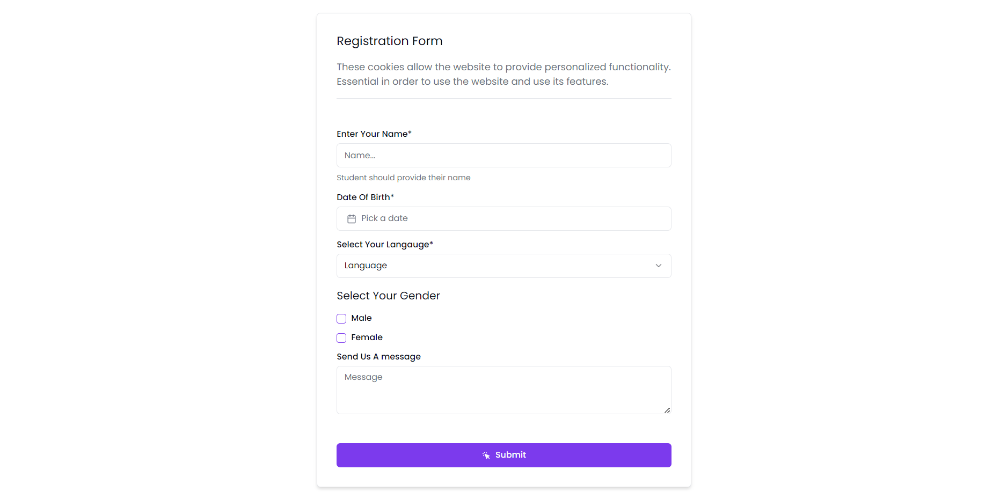
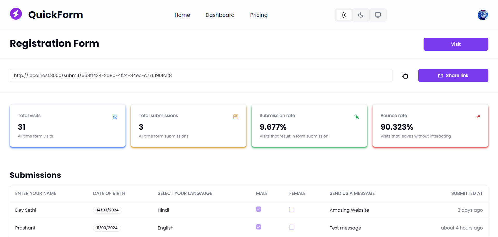

# Quick Form Builder

Welcome to the Quick Form App repository! This project is a Next.js-based web application designed to facilitate easy form creation and management. With features like drag-and-drop form building, theme toggling, and a personalized dashboard, users can create custom forms, submit data, and manage submissions efficiently. The app integrates Prisma and PostgreSQL for data storage and Clerk for secure authentication.

## Demo

Check out the live demo of the Quick Form App [here](https://quick-form-one.vercel.app).

## Preview

### 1. User Dashboard



### 2. Create Form



### 3. Submit Form



### 4. Form Submissions



## Features

- **Form Builder:** Easily create custom forms with a drag-and-drop interface.
- **Theme Toggle:** Toggle between light and dark themes for personalized viewing.
- **Authentication:** Secure authentication powered by Clerk.
- **Personal Dashboard:** Manage forms and submissions in a personalized dashboard.
- **Submission Management:** View form submissions in a modern card format.
- **Prisma and PostgreSQL Integration:** Utilize Prisma and PostgreSQL for secure data storage.
- **Modern UI Design:** Enjoy a sleek and intuitive user interface.

## Getting Started

To run the Quick Form App locally, follow these steps:

1. Clone the repository to your local machine:

   ```bash
   git clone https://github.com/Devsethi3/Quick-Form-Builder.git
   ```

2. Navigate to the project directory:

   ```bash
   cd quick-form-builder
   ```

3. Install dependencies:

   ```bash
   npm install
   ```

4. Set up Prisma and PostgreSQL according to your environment.

5. Start the development server:

   ```bash
   npm run dev
   ```

6. Open your web browser and visit [http://localhost:3000](http://localhost:3000) to use the app.

## Usage

1. Login or register using the provided authentication system.
2. Create custom forms using the drag-and-drop form builder.
3. Submit data using the created forms.
4. Manage form submissions and view them in the dashboard.

## Contributing

Contributions are welcome! If you'd like to contribute to this project, please follow these steps:

1. Fork the repository.
2. Create a new branch for your feature or bug fix.
3. Make your changes and commit them with descriptive messages.
4. Push your changes to your fork.
5. Open a pull request to merge your changes into the main branch.

Thank you for checking out the Quick Form App repository. Start building custom forms with ease and efficiency today!
